# Rounds 5 and cross-round retrospective in progress (last updated 28th May 2026)

# IMC Prosperity 4

## Round 1

Items available for trading:
- `ASH_COATED_OSMIUM`
- `INTARIAN_PEPPER_ROOT`

Position limits:
- `ASH_COATED_OSMIUM: 80`
- `INTARIAN_PEPPER_ROOT: 80`

### Historical Data

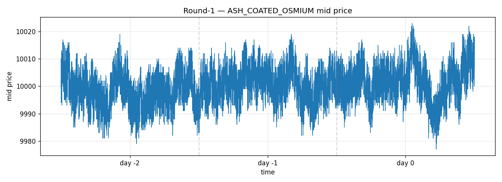

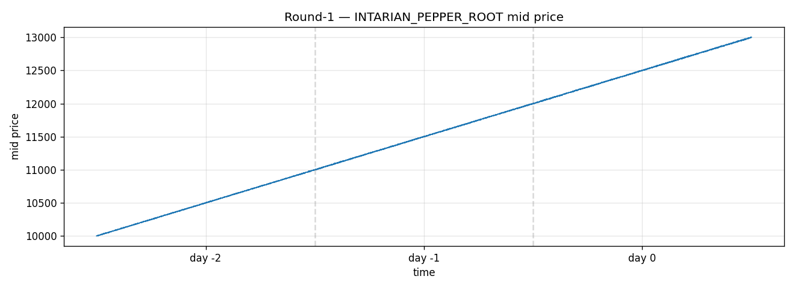

### Discussion

Other than a brief encounter with setting up the datamodel and trader classes for Round 0 (tutorial round), this was my first experience of digesting price data and creating a Python algorithm intended to trade it profitably.

I very much appreciated IMC not making Round 1 too complex and allowing the new participants to practice on something easier. It became clear that there were two main patterns that I needed to identify: `ASH_COATED_OSMIUM` was mean-reverting and `INTARIAN_PEPPER_ROOT` followed a mostly linear pattern.

My strategy for this round was therefore simple:
### `INTARIAN_PEPPER_ROOT` 
This asset utilized a long-biased buy-and-hold strategy with crash protection. At this point of the competition I was not sure whether regime change was going to be a factor that we had to be prepared for. Therefore, the strategy initially would blindly buy until the 80-unit long limit. The downside protection solution was to fit rolling 120 mid-prices into a linear trend and exit the position to zero if drawdown from the window exceeded 3% (allowing for minor price fluctuations since the trend was not "perfectly" linear). 

Another exit mechanism was to consider volatility. I theorized that a major regime change could be preceded by an increase in volatility, which could allow me to get out of the position before hitting my "stop-loss strategy". Therefore if residual volatility exceeded 8.0 the position would also be exited.

Re-entry criteria were set at:
```
slope > 0.05
resid_std < 1.5
```
The purpose of this implementation was to ensure that the position would only be re-entered during calm, upward trending periods in the market.

### `ASH_COATED_OSMIUM`
This asset was the more meaningful learning experience from Round 1. As seen from the price graph, `ASH_COATED_OSMIUM` was a mean-reverting asset. This meant that it tended to fluctuate around `price = 10,000`.

My first thought was to very simply go long and clear short inventory at prices below 10,000 and to go short and clear long inventory at prices above 10,000. There were several considerations that lead me to learn a lot about how mean-reverting assets are traded at a basic level:
- How do we decide what the "fair value" (mean-reverting target in this case) of the asset was? 10,000 is arbitrary in the sense that we cannot guarantee it does not change. Even if it looks right, can we just trust our vision and approximation to say the fair value really is 10,000? What about 10,050 or 9,950?
- Logically, the most profitable strategy will not be to go max long at 9,999 and max short at 10,001. While the mean-reverting nature suggests this could be a profitable strategy, we are leaving money on the table. Simply put, selling for a profit of 2 is less than selling for a profit of 100.
- If I have determined the point at which I want to start buying or selling, how can I try to guarantee that I do not max out my position limits in case the price continues to drift in that direction. If the price is at 9900 and my long inventory is maxed out, if the price drifts below 9900 I have no more buying power, meaning I cannot lock in these positions far from the mean.

In hindsight, these considerations were important throughout the competition. Mean-reverting assets were a consideration in every single round from this point onwards, having a good understanding was paramount.

My algorithm addressed these considerations with the following strategies:
The `ASH_COATED_OSMIUM` algorithm is a rolling-median market maker. It stores the last 30 mid-prices, uses their median as fair value, and quotes around that fair value. The quote edge is volatility-scaled with K_VOL = 5, bounded between 1 and 7. Inventory is managed with a skew: if the bot is long, it makes buys less attractive and sells more attractive; if short, the reverse. It also crosses obviously mispriced top-of-book orders before placing passive quotes.

### Results

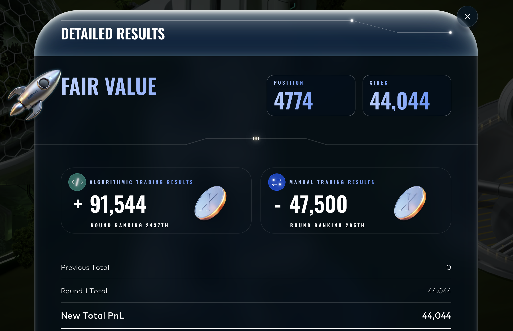

Round 1 results were less than stellar, lead by a misunderstanding of the manual trading round.

## Round 2

Items available for trading:
- `ASH_COATED_OSMIUM`
- `INTARIAN_PEPPER_ROOT`

Position limits:
- `ASH_COATED_OSMIUM: 80`
- `INTARIAN_PEPPER_ROOT: 80`

### Historical Data

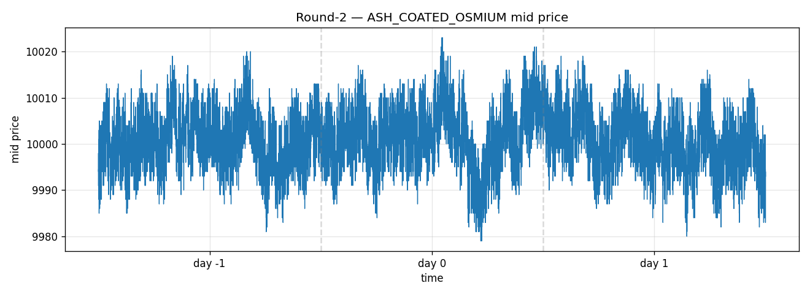

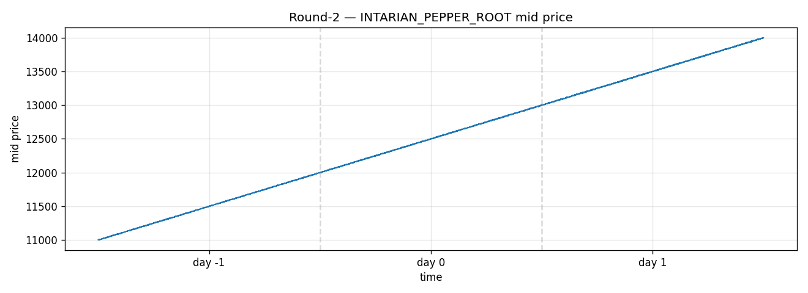

### Discussion

The most valuable information we were given in Round 2 was that our assumptions from Round 1 had held. We got an extra day of trading data and the patterns had not changed, `ASH_COATED_OSMIUM` was still exhibiting its mean-reversion around 10,000 and `INTARIAN_PEPPER_ROOT` was continuing its linear climb up. This meant that the algorithms did not have to be reinvented, only adjusted. The wiki mentioned "The products `INTARIAN_PEPPER_ROOT` and `ASH_COATED_OSMIUM` are the same", giving the necessary indication that regime change would likely not be a major concern. My placement in the previous round however told me there were plenty of profits left on the table, there was work to do.

One new opportunity was given to us. In Round 2, teams could bid for extra quotes in the order book. My initial thinking was that expanding the size of the order book could be beneficial, after all, more participants in the market would allow me to get my market-making positions filled more quickly. Upon further inspection however, it became clear that this would not be worth the cost.

By introducing more players into the market, spreads were likely to decrease as market-making participants would want to quote around the fair value to get their trades filled. A decrease in spreads meant less profitable trades, I therefore decided to bid 0 and to continue refining my existing algorithms.

### `ASH_COATED_OSMIUM`

The algorithm keeps the 30-tick rolling median fair value but separates volatility estimation into a longer 245-tick window. It also improves execution by sweeping multiple profitable book levels instead of only checking the best bid/ask. A position-reducing quote at fair value is added when inventory exceeds half the limit, helping unload risk without waiting for the normal edge quotes.

### `INTARIAN_PEPPER_ROOT`

The same long-with-safety logic remains, but re-entry is faster: REENTRY_BARS drops from 30 to 10. The aim was still to hold the upward-drifting product most of the time, while stepping aside during flash-crash or high-volatility regimes.

### Results

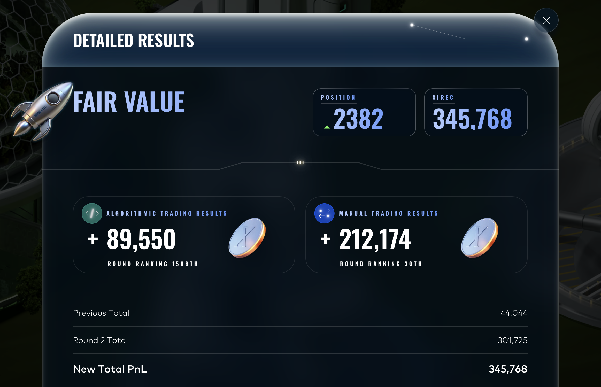

These results were promising. My algorithm had improved and my manual trading performance was very good. I cleared the `200,000 XIREC` threshold for qualifying for Round 3, where the leaderboard would reset.

## Round 3

Items available for trading:
- `HYDROGEL_PACK`
- `VELVETFRUIT_EXTRACT`
- `VEV_4000`
- `VEV_4500`
- `VEV_5000`
- `VEV_5100`
- `VEV_5200`
- `VEV_5300`
- `VEV_5400`
- `VEV_5500`
- `VEV_6000`
- `VEV_6500`

The voucher values represent the strike price of the options contract. Time to expiration at the beginning of the historical data was 8 days, therefore for the simulation round TTE would be set at 5 days.

Position limits:
- `HYDROGEL_PACK: 200`
- `VELVETFRUIT_EXTRACT: 200`
- `VEV_4000: 300`
- `VEV_4500: 300`
- `VEV_5000: 300`
- `VEV_5100: 300`
- `VEV_5200: 300`
- `VEV_5300: 300`
- `VEV_5400: 300`
- `VEV_5500: 300`
- `VEV_6000: 300`
- `VEV_6500: 300`

### Historical Data

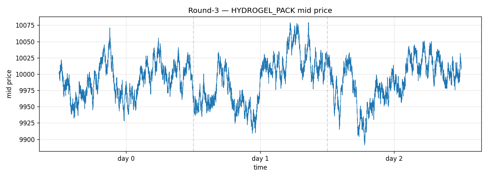

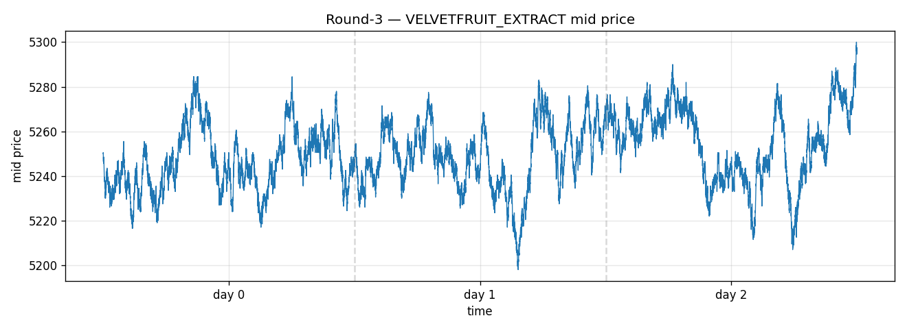

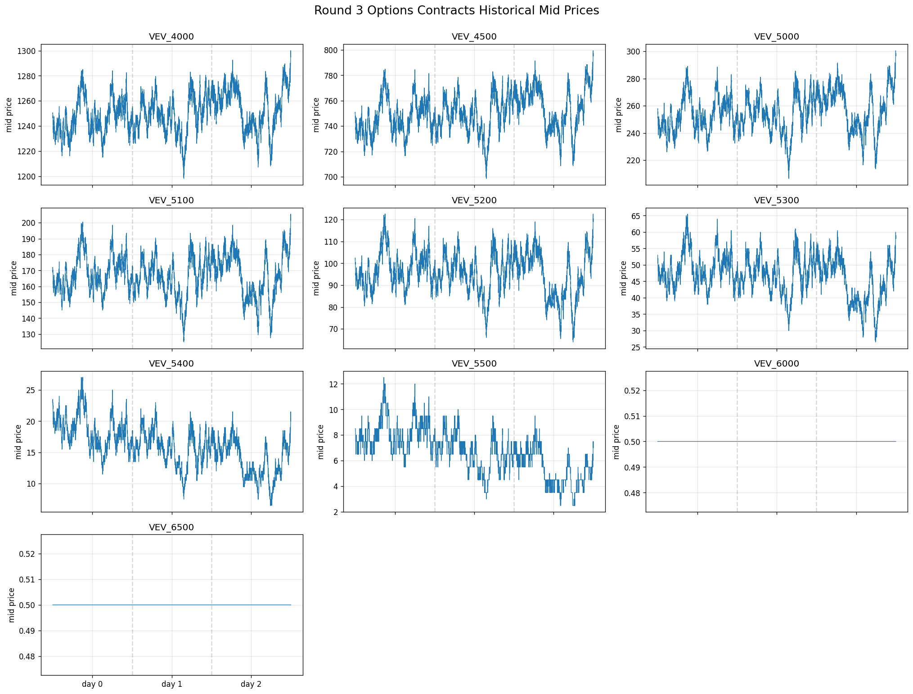

### Discussion

The most important takeaways from the historical price data in this round:
- Trends appear to be mean-reverting
- Higher strike prices (more OTM) have higher volatility but consistent directional movements with the other vouchers (following `VELVETFRUIT_EXTRACT`)
- Volume seems to be decreasing as strike prices get more OTM

### Strategy

Round 3 uses a common strategy for all tradable assets. It can still be best described as an anchored market maker. For each product, the algorithm keeps a 30-tick rolling mid-price cache and uses the median of those mids as the market-derived fair value. This market fair value is then blended with an anchor. The important change from the earlier version is that the anchor weight is no longer the same for every product.

The fair value is:
```
fair = (1 - anchor_weight) * rolling_median + anchor_weight * anchor
```
The configured fixed anchors are:
```
HYDROGEL_PACK = 10000
VELVETFRUIT_EXTRACT = 5250
VEV_4000 = 1260
VEV_4500 = 755
VEV_5000 = 265
VEV_5100 = 170
VEV_5200 = 97
VEV_5300 = 46
VEV_5400 = 15
VEV_5500 = 6
```
`VEV_6000` and `VEV_6500` have position limits but no fixed anchors.

Since the `VEV` products were options contracts with the strike price included in the name, I also added a simple Black-Scholes pricing component. The algorithm uses `VELVETFRUIT_EXTRACT` as the underlying, parses the strike from the voucher name, and calculates implied volatility from the available voucher mid-prices. It then takes the median implied volatility across the vouchers and uses that to create an IV-based anchor for each `VEV` product. Time to expiry is modeled with:
```
INITIAL_TTE_DAYS = 5
DAYS_PER_YEAR = 365
```
For vouchers with both a fixed anchor and an IV anchor, the final anchor is:
```
anchor = 0.75 * fixed_anchor + 0.25 * iv_anchor
```
If a voucher has no fixed anchor, as is the case for `VEV_6000` and `VEV_6500`, the IV anchor can be used on its own when it is available. Otherwise, the product falls back to the rolling median.

The quote edge is volatility-based, but it also takes the current spread into account. It uses half of the current spread plus the standard deviation of the 30 recent mids multiplied by `k_vol`, then clips this between the product's `min_edge` and `max_edge`:
```
base_edge = half_spread + k_vol * stdev(recent_mids)
```

The product-specific parameters are:
```
HYDROGEL_PACK: anchor_weight = 0.20, k_vol = 8.0, min_edge = 4.0, max_edge = 10.0, skew_coef = 3.0
VELVETFRUIT_EXTRACT: anchor_weight = 0.35, k_vol = 5.0, min_edge = 1.0, max_edge = 7.0, skew_coef = 3.0
VEV_4000: anchor_weight = 0.40, k_vol = 5.0, min_edge = 1.0, max_edge = 6.0, skew_coef = 2.0
VEV_4500: anchor_weight = 0.40, k_vol = 5.0, min_edge = 1.0, max_edge = 4.0, skew_coef = 3.5
VEV_5000: anchor_weight = 0.45, k_vol = 5.0, min_edge = 1.0, max_edge = 4.0, skew_coef = 4.5
VEV_5100: anchor_weight = 0.45, k_vol = 5.0, min_edge = 1.0, max_edge = 4.0, skew_coef = 5.0
VEV_5200: anchor_weight = 0.45, k_vol = 5.0, min_edge = 1.0, max_edge = 2.0, skew_coef = 6.0
VEV_5300: anchor_weight = 0.50, k_vol = 5.0, min_edge = 1.0, max_edge = 2.0, skew_coef = 6.0
VEV_5400: anchor_weight = 0.50, k_vol = 5.0, min_edge = 1.0, max_edge = 2.0, skew_coef = 6.0
VEV_5500: anchor_weight = 0.50, k_vol = 5.0, min_edge = 1.0, max_edge = 2.0, skew_coef = 6.0
VEV_6000: anchor_weight = 0.50, k_vol = 5.0, min_edge = 1.0, max_edge = 2.0, skew_coef = 6.0
VEV_6500: anchor_weight = 0.50, k_vol = 5.0, min_edge = 1.0, max_edge = 2.0, skew_coef = 6.0
```

Execution has three layers:

- It aggressively buys asks below fair - buy_edge.
- It aggressively sells bids above fair + sell_edge.
- It places passive bid/ask quotes at rounded fair-minus-edge and fair-plus-edge if capacity remains.

Inventory is managed by skewing edges with each product's `skew_coef`. A long position widens the buy edge and tightens the sell edge, encouraging selling; a short position does the opposite. If absolute inventory exceeds half the limit, it also places a position-reducing order at rounded fair value when possible.

### Volatility Smile Fit

The IV anchor described above collapses the whole voucher chain into a single number, the median implied volatility across strikes. That implicitly assumes a flat smile, which is a poor model for an options surface where deeper OTM strikes typically trade at richer IVs than ATM strikes. In parallel to the live algorithm I built a smile-fitting pipeline to see whether a per-strike fitted IV would price the vouchers more accurately than the median.

For every snapshot the pipeline computes, for each `VEV_*` product with a usable mid:
```
moneyness = log(strike / spot) / sqrt(T)
iv        = implied_vol(mid, spot, strike, T)   # bisection on Black-Scholes
```
`VELVETFRUIT_EXTRACT` is used as the spot. Time to expiry uses the same calendar as the live algorithm:
```
INITIAL_TTE_DAYS = 5
DAYS_PER_YEAR    = 365
```
Each voucher is then classified as a fit candidate if its mid is liquid enough and its IV is not pinned to the bisection floor:
```
fit_candidate = iv > 0.05 and mid >= 2.0
```
With at least 4 fit candidates the pipeline fits a quadratic in moneyness via normal equations (closed-form 3x3 solve, no external dependencies needed):
```
fitted_iv(m) = a * m^2 + b * m + c
```

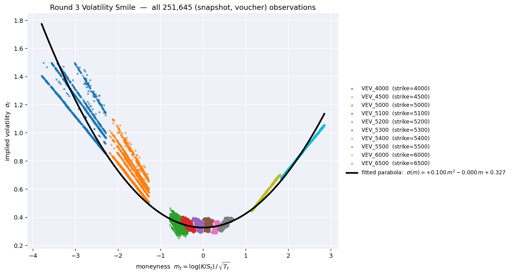

The figure above is reproduced by [plot_round_3_volatility_smile.ipynb](./notebooks/plot_round_3_volatility_smile.ipynb). Each color is one voucher strike, and each point is the implied vol at one historical snapshot — so as the underlying drifts over the round, every strike traces out an arc in moneyness space. Pooled across all 3 days the cloud paints the full smile: ATM vouchers (`VEV_5000`–`VEV_5500`, around `m ≈ 0`) sit near a vol of `0.33`, while the deep ITM (`VEV_4000`, `VEV_4500`) and deep OTM (`VEV_6000`, `VEV_6500`) wings lift sharply to vols of `1.0` and higher. A single parabola fit to all observations recovers a symmetric `σ(m) ≈ 0.10 m² + 0.33`, which matches the curvature of the cross-sectional smile that the live pipeline fits per-snapshot. The wing-IV blow-up is the same effect that motivates the live algorithm's `iv > 0.05 and mid >= 2.0` filter and its widened edges on the outermost strikes.
That fitted IV is fed back into Black-Scholes per strike to produce the smile fair value, and the residual against the live mid becomes the rich/cheap signal:
```
smile_fair = bs_call(spot, strike, T, fitted_iv(moneyness))
residual   = mid - smile_fair
```
Vouchers that fail the fit-candidate filter, or snapshots where fewer than 4 candidates are available, fall back to `smile_fair = mid` with a zero residual rather than extrapolating off a poorly-constrained curve. For non-voucher products (`HYDROGEL_PACK`, `VELVETFRUIT_EXTRACT`) the pipeline reuses the rolling-median-with-anchor fair from the live algorithm so the output CSV is directly comparable across products. The rolling parameters used for that leg are:
```
ANCHOR_WINDOW = 30
ANCHOR_WEIGHT = 0.30   # HYDROGEL_PACK and VELVETFRUIT_EXTRACT
vol_window    = 245    # longer window for sigma than for the median
```
The output (`fair_values_round3_option_smile.csv`) records `mid_price`, `fair_value`, `fair_source`, `moneyness`, `implied_vol`, `fitted_iv`, `residual`, and the fitted coefficients `(a, b, c)` per timestamp. In practice the residual track confirmed the intuition behind the live algorithm's anchor blend: the wings (`VEV_4000`, `VEV_6000`, `VEV_6500`) carry the largest residuals and the least reliable IVs, which is why the live quoting logic widens edges and skews more aggressively on those strikes rather than trusting their market mids on their own.

### Results


These results were very promising, my algorithm had worked as intended and I was in a good position going into round 4.

### Improvements

Looking back at Round 3 with the smile chart in hand, the most obvious thing my algorithm gets wrong is the way it treats implied volatility. The `vev_iv_anchors` function collapses the whole option chain into a single number, `cross_section_iv = median(implied_vols)`, and then uses that one IV to price every strike with Black-Scholes. That is a flat-smile assumption, and the smile chart shows the smile is not flat at all.

Concretely, at the reference snapshot used in the chart (spot ≈ 5243, T ≈ 3.5 days), the algorithm's per-strike IVs and the fitted smile compare as follows:
```
strike   algo IV    smile σ(m)
4000     1.70       ~1.20
4500     0.99       ~0.50
5000     0.50       ~0.353
5100     0.39       ~0.338
5200     0.36       ~0.330
5300     0.34       ~0.328
5400     0.32       ~0.331
5500     0.34       ~0.338
median   0.373      (smile floor ≈ 0.327)
```
So the single `cross_section_iv` of ~0.37 sits between the ATM vol of ~0.33 and the wing vols that run from 0.5 all the way to 1.7. For the ATM strikes the IV anchor is roughly 10% too high; for the deep wings, pricing `VEV_4000` with σ = 0.37 instead of σ ≈ 1.7 puts the model value far below the market mid.

Two things kept this from hurting the algorithm too much:
1. `VEV_IV_BLEND = 0.25` only gives the IV anchor a quarter of the weight. The other 75% goes to the hand-tuned `PRODUCT_ANCHORS` (1260, 755, 265, ..., 6), which I had set by eye to match where each strike was actually trading. The smile is in the algorithm — just baked into hardcoded numbers rather than fitted from data.
2. The rolling-median fair value still dominates many strikes (`anchor_weight` between 0.4 and 0.5), so the IV anchor never gets to move the fair value by more than half its distance from the rolling median anyway.

The clean improvement is to replace the flat cross-sectional IV with a per-strike smile-fitted IV, exactly as the parabolic fit in the section above:
```
fitted_iv(m) = a * m^2 + b * m + c
iv_anchor    = bs_call(spot, strike, T, fitted_iv(moneyness))
```
That would let me drop the hand-tuned `PRODUCT_ANCHORS` entirely (or shrink them to a small theta-decay offset), and it would handle `VEV_6000` and `VEV_6500` properly — those are the two strikes that currently have no fixed anchor and have to fall back to the cross-sectional IV alone, which is exactly where the flat-smile assumption is most wrong.

I did not ship this during the round itself because retuning the anchor logic mid-competition felt riskier than refining what was already working. The smile-fitting pipeline that produced the chart above lives outside the live algorithm, and integrating it as the IV anchor source would be the natural follow-up for Round 5 (or any future options round).

## Round 4

Items available for trading:
- `HYDROGEL_PACK`
- `VELVETFRUIT_EXTRACT`
- `VEV_4000`
- `VEV_4500`
- `VEV_5000`
- `VEV_5100`
- `VEV_5200`
- `VEV_5300`
- `VEV_5400`
- `VEV_5500`
- `VEV_6000`
- `VEV_6500`

Time to expiration for the simulation round TTE was set at 4 days.

Position limits:
- `HYDROGEL_PACK: 200`
- `VELVETFRUIT_EXTRACT: 200`
- `VEV_4000: 300`
- `VEV_4500: 300`
- `VEV_5000: 300`
- `VEV_5100: 300`
- `VEV_5200: 300`
- `VEV_5300: 300`
- `VEV_5400: 300`
- `VEV_5500: 300`
- `VEV_6000: 300`
- `VEV_6500: 300`

### Historical Data

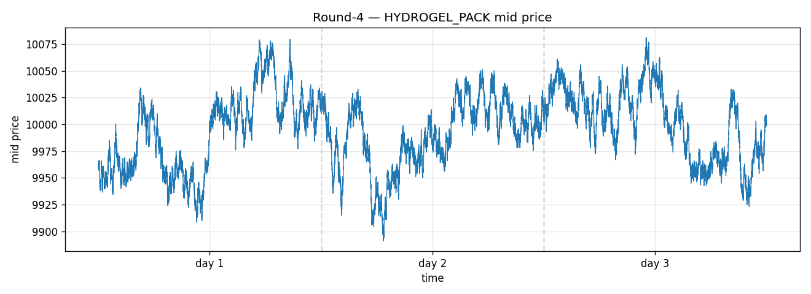

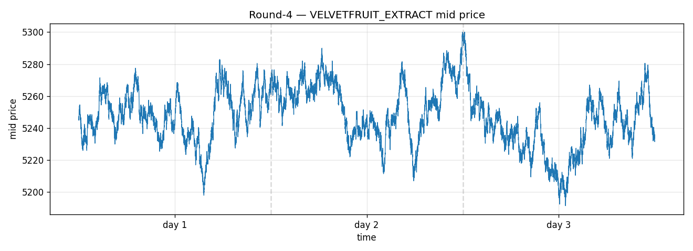

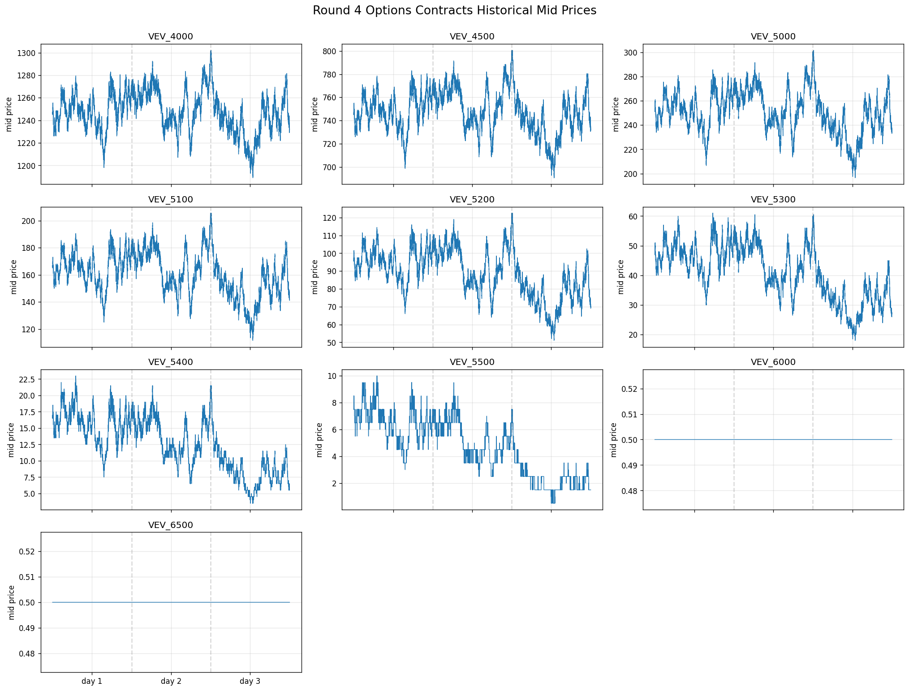

### Discussion

Round 4 was mainly a continuation of Round 3. The main difference was that we were given access to the trader IDs in the trading data. This gave us the opportunity to find patterns in the trading data that could be attributed to the behavior of one or more of the traders. I built a trade explorer to better visualize these relationships:

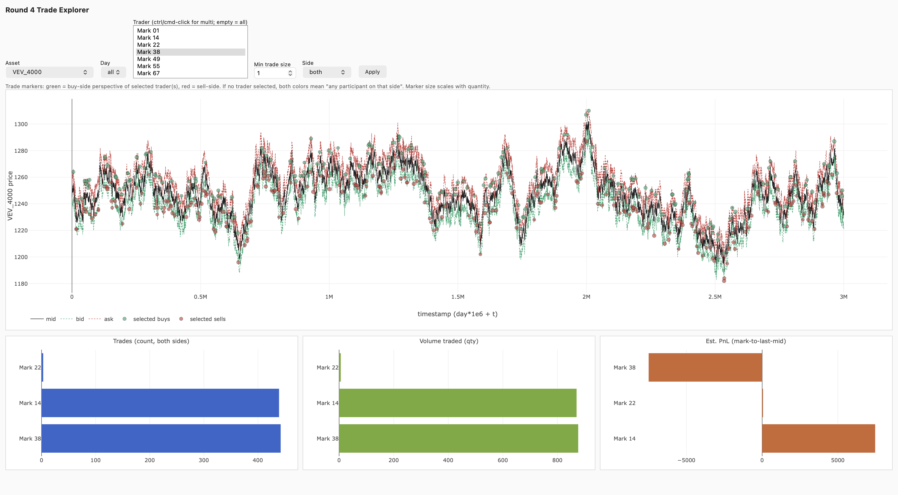

Some trades seemed interesting, there were cases where sales were happening just before trend-reversals but my research could not find a relationship strong enough to be worth exploiting. I spent most of Round 4 on refining the strategies I had created in Round 3.

### Strategy

The overall structure did not change much: the algorithm still trades `HYDROGEL_PACK`, `VELVETFRUIT_EXTRACT`, and the `VEV_*` voucher products by estimating fair value, quoting around it, taking clearly mispriced book levels, and skewing quotes based on inventory.

The main change from Round 3 was retuning. By this point, the IV-anchored voucher model was already in place, so Round 4 was not a new strategy so much as a more aggressive version of the same one. The fair value was still based on:

- Rolling median market fair
- Fixed hand-tuned anchor
- For `VEV_*` products, a Black-Scholes implied-volatility anchor

The option logic continued to use `VELVETFRUIT_EXTRACT` as the underlying. It parsed the strike from each `VEV_*` product, calculated implied volatility from available voucher mid-prices, took the median cross-sectional IV, and then repriced each voucher with Black-Scholes. These model prices were blended with fixed anchors using:
```
VEV_IV_BLEND = 0.25
```
The time-to-expiry assumption was also updated for the next round:
```
INITIAL_TTE_DAYS = 4
DAYS_PER_YEAR = 365
```
The fixed anchors were retuned. This was a way of hardcoding theta decay into the algorithm, since the asset was mean-reverting there was not a big concern about computing theta decay reliably and dynamically:
```
HYDROGEL_PACK = 10000
VELVETFRUIT_EXTRACT = 5250
VEV_4000 = 1250
VEV_4500 = 750
VEV_5000 = 250
VEV_5100 = 152
VEV_5200 = 75
VEV_5300 = 30
VEV_5400 = 7
VEV_5500 = 1
```

Compared with Round 3, the anchor weights became much stronger for many products. For example, `HYDROGEL_PACK` used `anchor_weight = 0.7`, while several far OTM vouchers used `anchor_weight = 0.99`. This meant the algorithm trusted the fixed/model anchor much more and the rolling market median less. These changes came about mainly as a result of manual backtesting adjustments.

The market-making parameters were also adjusted per product. Some products used wider edge bounds and stronger inventory skew, especially `HYDROGEL_PACK`, `VEV_4000`, and the far OTM vouchers. The aim was to keep the same systematic market-making logic while making the quotes more product-specific.

### Results

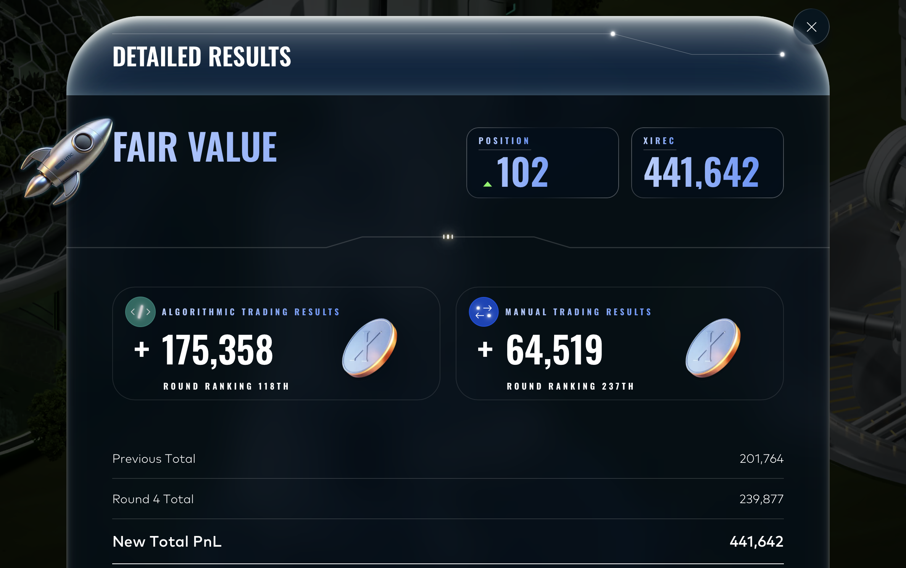

Overall, Round 4 was a refinement of the Round 3 strategy: use fixed valuations where useful, use Black-Scholes relative pricing for the vouchers, and tune each product's edge and inventory behavior more aggressively to harvest spread while staying within position limits. The results show a modest increase in PNL, so I would consider this time well spent, my algorithm was nearing top 100 in terms of performance.

## Round 5

Items available for trading:
- `GALAXY_SOUNDS_DARK_MATTER`
- `GALAXY_SOUNDS_BLACK_HOLES`
- `GALAXY_SOUNDS_PLANETARY_RINGS`
- `GALAXY_SOUNDS_SOLAR_WINDS`
- `GALAXY_SOUNDS_SOLAR_FLAMES`
- `SLEEP_POD_SUEDE`
- `SLEEP_POD_LAMB_WOOL`
- `SLEEP_POD_POLYESTER`
- `SLEEP_POD_NYLON`
- `SLEEP_POD_COTTON`
- `MICROCHIP_CIRCLE`
- `MICROCHIP_OVAL`
- `MICROCHIP_SQUARE`
- `MICROCHIP_RECTANGLE`
- `MICROCHIP_TRIANGLE`
- `PEBBLES_XS`
- `PEBBLES_S`
- `PEBBLES_M`
- `PEBBLES_L`
- `PEBBLES_XL`
- `ROBOT_VACUUMING`
- `ROBOT_MOPPING`
- `ROBOT_DISHES`
- `ROBOT_LAUNDRY`
- `ROBOT_IRONING`
- `UV_VISOR_YELLOW`
- `UV_VISOR_AMBER`
- `UV_VISOR_ORANGE`
- `UV_VISOR_RED`
- `UV_VISOR_MAGENTA`
- `TRANSLATOR_SPACE_GRAY`
- `TRANSLATOR_ASTRO_BLACK`
- `TRANSLATOR_ECLIPSE_CHARCOAL`
- `TRANSLATOR_GRAPHITE_MIST`
- `TRANSLATOR_VOID_BLUE`
- `PANEL_1X2`
- `PANEL_2X2`
- `PANEL_1X4`
- `PANEL_2X4`
- `PANEL_4X4`
- `OXYGEN_SHAKE_MORNING_BREATH`
- `OXYGEN_SHAKE_EVENING_BREATH`
- `OXYGEN_SHAKE_MINT`
- `OXYGEN_SHAKE_CHOCOLATE`
- `OXYGEN_SHAKE_GARLIC`
- `SNACKPACK_CHOCOLATE`
- `SNACKPACK_VANILLA`
- `SNACKPACK_PISTACHIO`
- `SNACKPACK_STRAWBERRY`
- `SNACKPACK_RASPBERRY`

Position limits:
- All products: `10`

### Historical Data

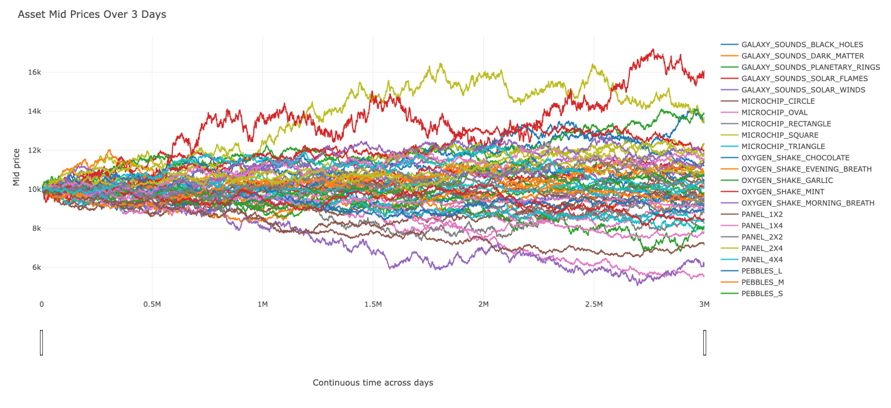

### Discussion

As is evident from the above graph (note: some assets are missing from the legend but are still included), it was not clear after a quick analysis what the strategies for this round might look like. Especially for a team of one, it was evident that this round would be time-consuming.

I initially looked to see if the "baskets" held any useful information. There were 10 baskets in this dataset, with 5 assets in each:

- `GALAXY_SOUNDS`
- `SLEEP_POD`
- `MICROCHIP`
- `PEBBLES`
- `ROBOT`
- `UV_VISOR`
- `TRANSLATOR`
- `PANEL`
- `OXYGEN_SHAKE`
- `SNACKPACK`

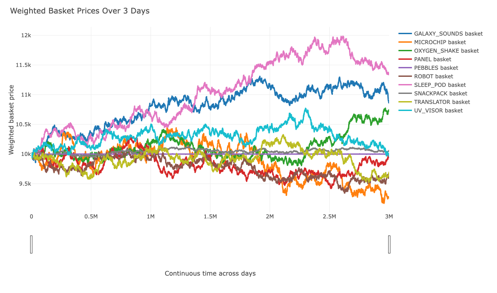

The most useful part of visualizing the baskets was seeing the chart for `PEBBLES`:

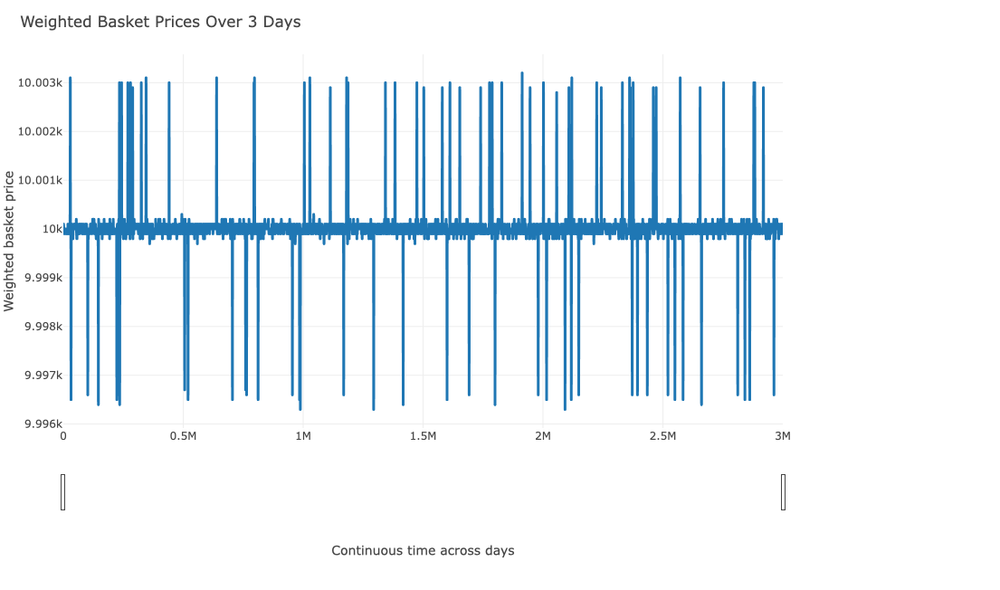

This basket of equal weightings resulted in a chart that only slightly deviated from a mean of 10,000. The trading algorithm could trade this pattern profitably.

### `PEBBLES Basket`

The algorithm used arbitrage within the PEBBLES basket to trade profitably. When the combined ask was below 49,999 the algorithm would buy as much inventory as it could, and if it was at 50,001 or above it would sell as much as it could.

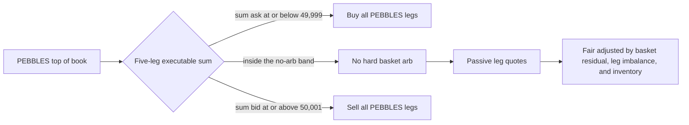

The basket fair value was `50,000`, with each of the five `PEBBLES` products capped at `10`. The maximum hard basket trade size was therefore also `10`, and the algorithm traded all legs together to avoid building an unintended outright position in one pebble product.

### Strategy

Round 5 was much larger than the earlier rounds. Instead of focusing on one or two products, `round-5.py` became a portfolio strategy across many low-limit products, all capped at `10`. The main idea was to exploit cross-sectional structure wherever it appeared: exact basket sums, EMA mean reversion, pair spreads, jump reversals, and passive spread capture.

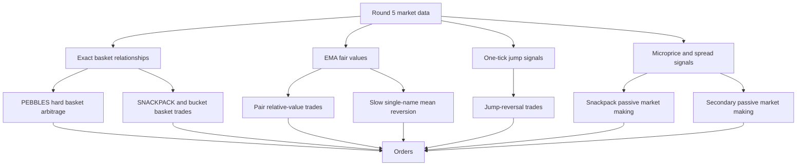

There were several independent modules:

- `PEBBLES` basket arbitrage traded all five pebble products together when their combined ask was below `49,999` or their combined bid was above `50,001`, around a fair basket sum of `50,000`.
- Passive `PEBBLES` quoting ran when no hard basket arbitrage existed. It quoted each leg around a fair value adjusted by total basket residual, leg imbalance, and inventory skew, trying to earn spread while keeping the basket balanced.
- Jump-reversal trades targeted products including `ROBOT_DISHES`, `ROBOT_IRONING`, `OXYGEN_SHAKE_CHOCOLATE`, `UV_VISOR_RED`, `MICROCHIP_OVAL`, and `PANEL_1X2`. The signal looked for large one-tick mid-price jumps and bet on partial reversal using product-specific negative beta, threshold, target size, edge buffer, and maximum book levels to cross.
- `SNACKPACK` basket mean reversion tracked an EMA fair value for the sum of five snackpack products. If the whole basket was cheap versus the EMA by more than `100`, it bought all legs; if rich by more than `100`, it sold all legs. The basket size was `2`.
- Pair relative-value trades tracked EMA spreads between configured product pairs. When the executable top-of-book spread deviated enough, the algorithm bought the cheap leg and sold the rich leg. This covered pebble pairs, microchip pairs, translator pairs, robot pairs, sleep pod pairs, UV visor pairs, oxygen shake pairs, panel pairs, and snackpack pairs.
- Bucket basket EMA trades extended the snackpack idea to full product groups: `ROBOT`, `OXYGEN_SHAKE`, `UV_VISOR`, and `GALAXY_SOUNDS`. Each group traded all legs together when its summed price moved far enough from its EMA.
- `SNACKPACK` passive market making maintained an EMA and residual variance per snackpack product. It quoted passively when z-score and microprice signals suggested mean reversion, with inventory skew.
- Slow single-name mean reversion targeted products such as `PANEL_2X2`, `MICROCHIP_TRIANGLE`, `MICROCHIP_RECTANGLE`, `UV_VISOR_MAGENTA`, and `GALAXY_SOUNDS_DARK_MATTER`. It used EMA, residual standard deviation, z-score entry thresholds, aggressive crossing when the edge was large, and passive quotes when deviation was milder.
- Secondary passive market making quoted selected products with wider spreads, using microprice-adjusted fair value and soft inventory caps. This was only enabled for names with apparently better historical markouts.

The execution order mattered because many products were eligible for more than one signal. Earlier modules had priority, and later modules skipped a product if it already had an order. This prevented the strategy from stacking conflicting instructions on the same 10-lot position limit.

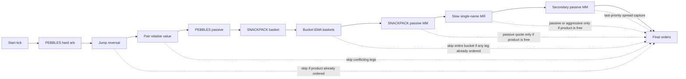

The result was a portfolio-style strategy rather than a single-model strategy. The strongest opportunities were exact or near-exact cross-sectional trades, while the passive modules acted as lower-priority spread capture when the more directional signals were inactive.

